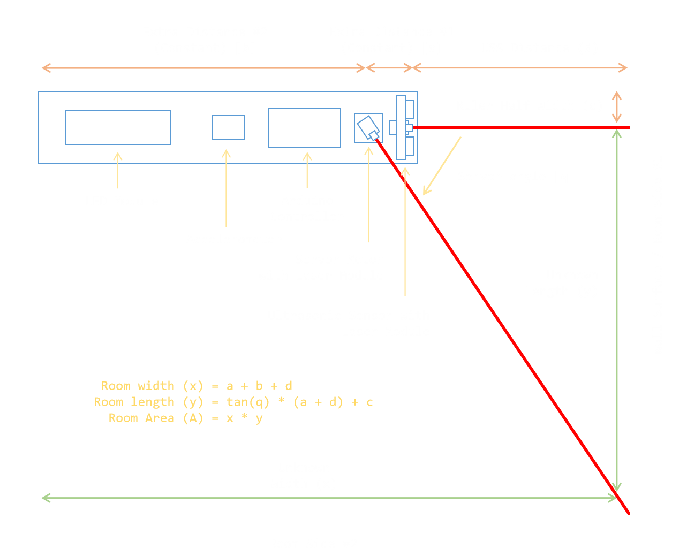

# Arduino Digital Ruler
Room Dimensions Measuring Tool Using Arduino

**Arduino Digital Ruler** is capable of measuring dimensions of a rectangular room. By placing the ruler on a corner of the room and pointing the laser beam into opposite corner is enough to calculate these dimensions.



## Calculation Procedure

This device has a constant length `(a + b)` separated into two parts such as length between the ultrasonic sensor and the laser module `(a)` and the length between the laser module and the rear end of the ruler `(b)`.

The distance that calculates using ultrasonic sensor `(d)` will be adding into those two constant lengths. That length will be the final length of a side of a room `(x)`.

Other side length of the room will be calculated using tangent of the angle created by laser beam `(q)`. Also the half width of the ruler should be included into this calculation to get the final width of the room `(y)`.

Accelerometer module will help to check the balance of the ruler to the ground. And that will avoid most of the errors that may effect on final result.

## Required Components

- Arduino UNO
- Ultrasonic Sensor (HC-SR04)
- Servo Motor (SG90)
- Laser Module (650nm) x 2
- Accelerometer Module (ADXL345)
- LCD Module (1602)
- I2C Module (PCF8574T)
- 2 Push Buttons Keypad

## Circuit Diagram

Following diagram shows the structure to connect each component. Some of the components that require large energy input are connected to an external 5V source to function this device properly.


## Program Structure

This [source](./source/) directory contains all the program files that should be compiled and uploaded to the Arduino UNO. Consider the following file listing to understand the structure of the code base.

- modules
    - `accelerometer.h` - Functions to setup and control the accelerometer module
    - `display.h` - Functions to setup and control the LCD module
    - `servo.h` - Functions to setup and control the Servo motor
    - `ultrasonic.h` - Functions to setup and control the ultrasonic sensor
- `extern.h` - Extends the visibility of functions
- `global.h` - Variables that belongs to global scope
- `setup.h` - Pin indices and other values that should be configured before running
- `source.ino` - Main program file that includes `setup` and `loop` functions

**NOTE:** *Check the source code comments of each file for more explanations.*

## External Libraries

ADXL345 module and LCD with I2C require additional libraries to function. Make sure to copy all of those [external libraries](./libraries/) into following Arduino IDE program's libraries directory:

```
C:\Program Files (x86)\Arduino\libraries
```

### Developed by Deshan Nawanjana

[DNJS](https://dnjs.info/)
&ensp;|&ensp;
[LinkedIn](https://www.linkedin.com/in/deshan-nawanjana/)
&ensp;|&ensp;
[GitHub](https://github.com/deshan-nawanjana)
&ensp;|&ensp;
[YouTube](https://www.youtube.com/channel/UCfqOF8_UTa6LhaujoFETqlQ)
&ensp;|&ensp;
[Blogger](https://dn-w.blogspot.com/)
&ensp;|&ensp;
[Facebook](https://www.facebook.com/mr.dnjs)
&ensp;|&ensp;
[Gmail](mailto:deshan.uok@gmail.com)